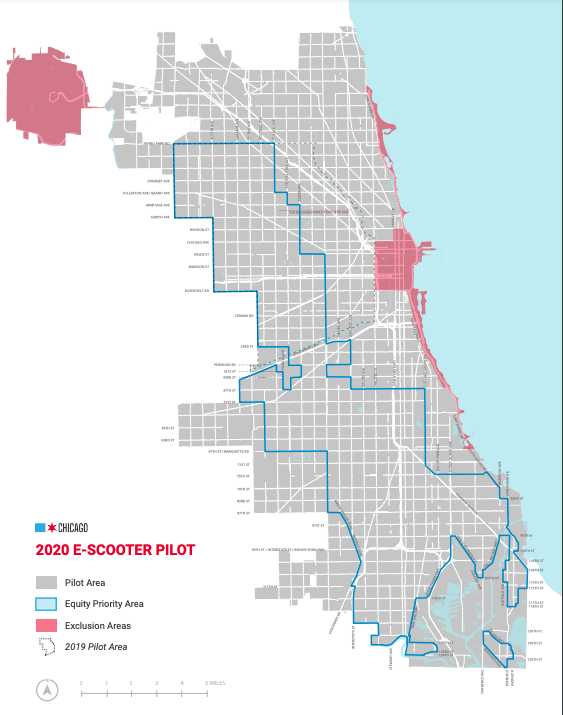

# Theory & Practice of Data Cleaning Final Project
#### James Dudley
#### July 31, 2021
#### CS 513

## Introduction
Shared electric scooters first hit consumers in September 2017 when the then start-up, Bird, descended on Santa Monica, California.  Within 14 months, the company was valued at over $2 billion and had a presence in over 100 cities around the globe.  Shortly after that initial launch, more companies like Lyft, Uber, Spin, and Lime introduced their electric scooters.  What began as a novelty quickly drew controversial opinions and government regulations, but has more or less survived and is here to stay as a legitimate form of transportation around city centers.
According to the TomTom Traffic Index Report, traffic across cities worldwide had been steadily increasing for years until the Covid-19 pandemic temporarily reduced the number of commuters and city residents in many metropolitan areas.  After initial shake-out phases and pilot programs, many American cities in particular have embraced scooter programs not only as a way of reducing traffic, but as an extension of public transportation where infrastructure where it is lacking.  Now that the novelty has worn off and people are using scooters as a reasonable way to get from one place to another, there is a lot of potential to gain insight from the data and information generated by the scooters that people are riding.

## Identifying a Dataset
The dataset that has been selected for this project is the [E-Scooter Trips 2020 Pilot Program Dataset](https://data.world/cityofchicago/3rse-fbp6) produced by Data World and the City of Chicago.  For the 2020 Pilot program, the City updated the rules and requirements for e-scooter vendors based on the results of the 2019 data.  

  

As seen in Image 1 above, the scooters were limited allowed to operate citywide with a handful of exceptions.  Shared electric scooters were prohibited from the Lakefront Trail, Central Business District, and 606 Trail.  Additionally, vendors were limited to 3,333 scooters, had to deploy 50% to the Equity Priority Area shown in Image 1, and scooters could not be ridden on. Sidewalks between 5am and 10pm.  Lastly, riders were required to lock their scooters to a fixed object to end their trip to eliminate the sidewalk clutter and clear pathways for other pedestrians.
